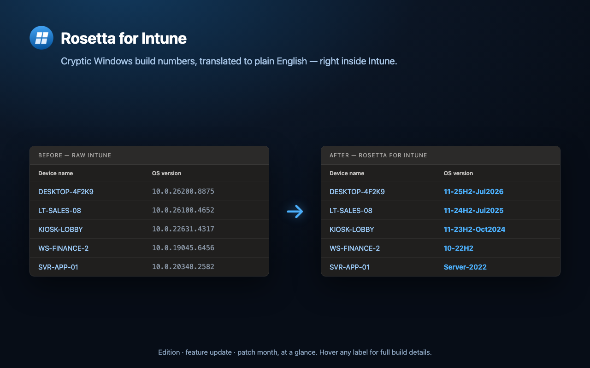
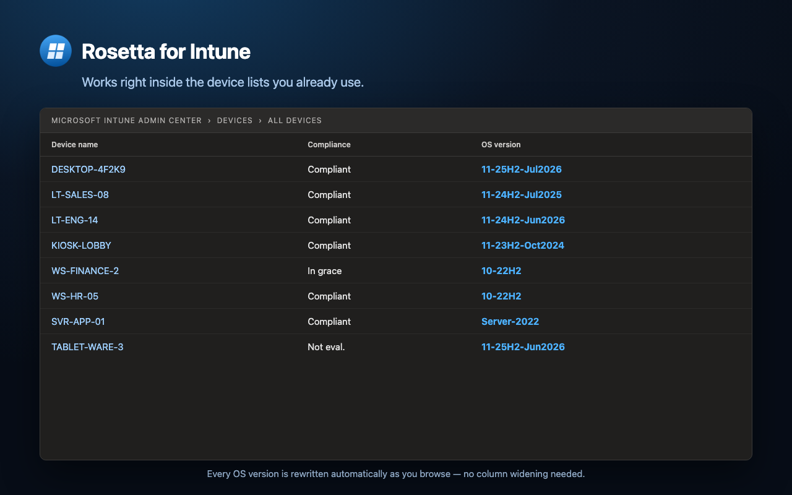
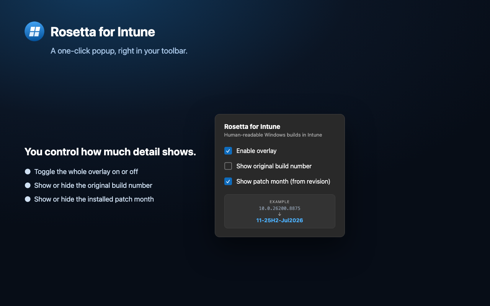
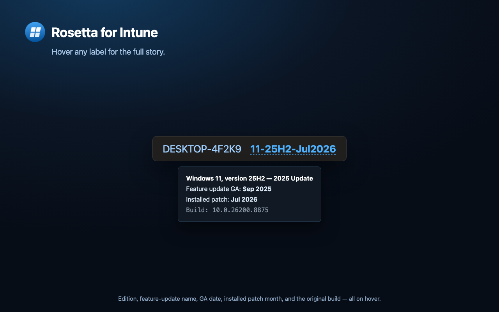
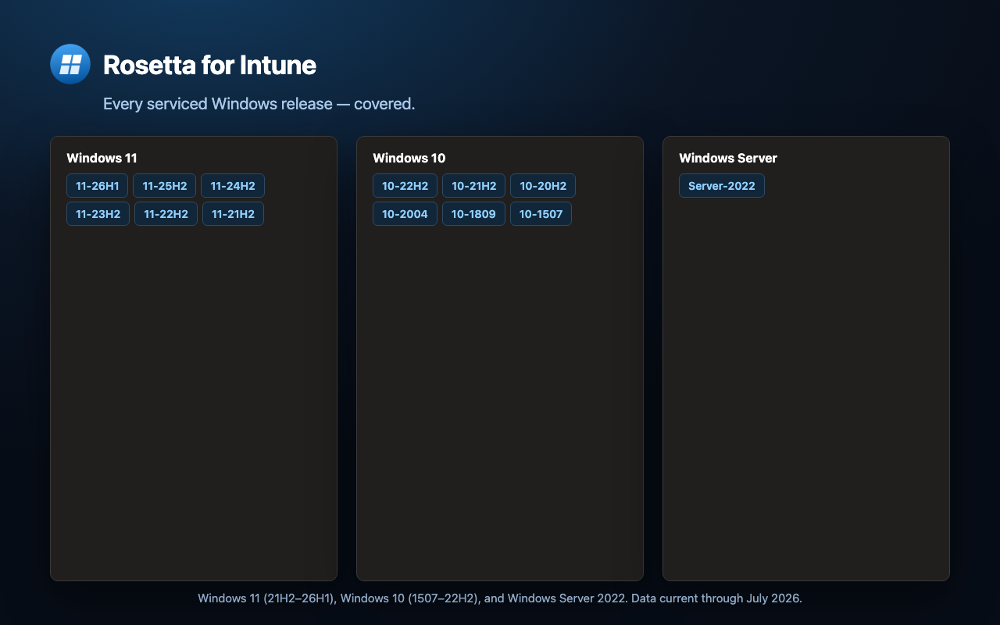

# Rosetta for Intune

A Chrome / Edge (Manifest V3) extension that translates the cryptic Windows build numbers
shown in the **Microsoft Intune admin center** into compact, human-readable labels.

> `10.0.26200.8875`  →  **11-25H2-Jul2026**

The label tells you the edition, the feature update, and the month the device was last
patched — at a glance. The original build is available on hover (and optionally inline).

[**▶ Install from the Chrome Web Store**](https://chromewebstore.google.com/detail/rosetta-for-intune/idamhefkokoaljmclafeddaiidpeince)



---

## What it does

The Intune **OS version** field reports strings like `10.0.26200.8875`:

| Segment | Meaning |
| --- | --- |
| `10.0` | NT kernel family (both Windows 10 & 11 report `10.0`) |
| `26200` | **Build** — identifies the feature update (25H2) |
| `8875` | **Revision** — identifies the monthly cumulative update (patch level) |

Rosetta:

- Maps the **build** to its Windows edition and feature-update version — e.g. `11-25H2`.
- Maps the **revision** to the exact patch **month/year** when it's in the bundled data —
  producing the full label `11-25H2-Jul2026`.
- Rewrites every occurrence anywhere in the console — device lists, device detail blades,
  reports — and keeps up with the SPA as you navigate. It pierces the Shadow DOM and the
  same-origin iframes that the Azure "Ibiza" portal framework renders Intune's grids in.

## Live, self-updating data

A background service worker keeps the build/revision database current by fetching Microsoft's
official Windows **release-health** pages, parsing them, and caching the result. New Windows
builds and monthly patch revisions are recognized **without an extension update**.

- Refreshes on install, on browser startup, once a day, and on demand (the popup's
  **Refresh now** button).
- The parsed live data is merged **over** a bundled snapshot, which stays as an always-available
  offline fallback — so the extension still works if the fetch fails or before the first refresh.
- Sources:
  - Windows 11: <https://learn.microsoft.com/windows/release-health/windows11-release-information>
  - Windows 10: <https://learn.microsoft.com/windows/release-health/release-information>

Only public release data is fetched — no accounts, analytics, or trackers, and no personal or
browsing data is ever sent or collected.

## Screenshots

**In context — right inside your device lists**



**Configurable — a one-click toolbar popup**



**Hover for the full build details**



**Broad coverage — Windows 11, 10, and Server**



## Install

**From the Chrome Web Store (recommended):**
[chromewebstore.google.com/detail/rosetta-for-intune](https://chromewebstore.google.com/detail/rosetta-for-intune/idamhefkokoaljmclafeddaiidpeince)

**Unpacked, for development:**

1. Open `chrome://extensions` in Chrome (or `edge://extensions` in Edge).
2. Enable **Developer mode** (top-right).
3. Click **Load unpacked** and select this repository's root folder (the one containing
   `manifest.json`).
4. Open [intune.microsoft.com](https://intune.microsoft.com) and browse to any page showing
   OS versions.

## Options

Click the toolbar icon to toggle:

- **Enable overlay** — master on/off.
- **Show original build number** — keep the raw `10.0.x.y` next to the friendly label (off by default).
- **Show patch month** — append the exact patch month derived from the revision.

Changes reload the active tab so the page re-renders with the new setting.

## Repository structure

```
manifest.json          MV3 manifest (Intune / Azure portal origins, learn.microsoft.com host)
src/background.js      Service worker — fetches & parses Microsoft release-health, caches live data
src/versions.js        Bundled build/revision fallback + lookup (merges live data over it)
src/content.js         DOM scanner + rewriter (Shadow DOM & iframe aware)
src/content.css        Badge styling (light + dark)
popup/                 Toolbar popup (settings, live-data status + Refresh now)
icons/                 Extension icons
store/                 Chrome Web Store submission materials (listing copy, privacy, imagery)
```

## Permissions

| Permission | Why |
| --- | --- |
| `storage` | Save display preferences and cache the live build database. |
| `alarms` | Schedule the once-daily background refresh. |
| host: `learn.microsoft.com` | Fetch Microsoft's public Windows release-health pages to refresh the data. |
| host: Intune / Azure portal origins | Read and rewrite the visible OS build-number text. |

## Keeping the data current

Currency is automatic — the background worker refreshes from Microsoft daily (see
[Live, self-updating data](#live-self-updating-data)). The bundled maps in
[`src/versions.js`](src/versions.js) (`WVE_BUILDS` / `WVE_REVISION_DATES`) exist only as the
**offline fallback**; you generally never need to touch them. If you want to raise the offline
floor (e.g. for an air-gapped environment that can't reach `learn.microsoft.com`), add rows
there from Microsoft's release-health pages.

Devices on a revision unknown to both live and bundled data still get the correct feature-update
label (e.g. `10-22H2`); only the trailing patch month is omitted.

## Notes

- Covers Windows 11 (21H2–26H1), Windows 10 (1507–22H2), and Windows Server 2022.
- Build `26100` is shared with Windows Server 2025 and `17763` with Server 2019; the client
  feature-update label is used since Intune device inventory is client-centric.
- The bundled data is current through the **July 2026** patch cycle.

## License

Released under the [MIT License](LICENSE). © 2026 Liacos Labs.

Rosetta for Intune is an independent project and is not affiliated with, endorsed by, or
sponsored by Microsoft Corporation. Windows, Microsoft Intune, and related marks are
trademarks of Microsoft Corporation.
